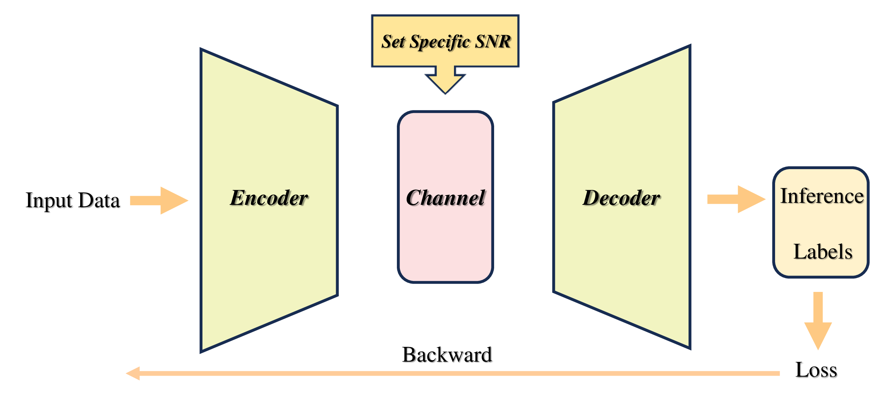
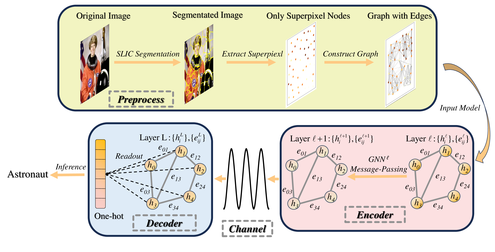

# GeNet

This repo is the implementation of the paper "GeNet: A Graph Neural Network-based Anti-noise
Task-Oriented Semantic Communication Paradigm" (arxiv link: TBD) using PyTorch.
### Architecture
General semantic communication paradigm:

GeNet semantic communication paradigm:



### Installation
And all experiments are conduct either on a computer equipped with a single NVIDIA GeForce RTX3090 GPU (Ubuntu 20.04, CUDA 12.0, Python 3.10.13)
or one with two NVIDIA GeForce RTX3090 GPUs (Ubuntu 22.04, CUDA 11.6, Python 3.10.13).
```
git clone https://github.com/chunbaobao/GeNet
cd GeNet
pip install -r requirements.txt
```
### Dataset Preparation
The `prepare_dataset.py` script is used to convert images from CIFAR-10, MNIST, and FashionMNIST datasets into graph structures.
```
python prepare_dataset.py # for all datasets
python prepare_dataset.py --dataset $DATASET_NAME # for a specific dataset
```
The `$DATASET_NAME.pkl` files will be saved in the `./data` directory by default.
### Training
The `train.py` script is used to train the GeNet model.

```
python train.py --out $OUTPUT_DIR --dataset_name $DATASET_NAME --model_name $MODEL_NAME
```
For loops within Python can cause process killing for unknown reasons, so bash script are provided for training all backbone GNN models of GeNet on all datasets.
```
bash run.sh
```
### Evaluation
The `eval.py` provides the evaluation of the trained GeNet model and baseline models. 

You may need modify slightly to evaluate the GeNet or baseline models in `__main__` function. And for GeNet evaluation, you need to specify the path to the trained model in `eval_model` function.
```
python eval.py
```
All training and evaluation results are saved in the `./out` directory by default. The `./out` directory may contain the structure as follows:
```
./out
├── checkpoint # trained models
│   ├── $MODELNAME_$DATASETNAME_$TIMES_on_$DATE_$HOST
│       ├── epoch_$num.pth
│       ├── ...
│   ├── GAT_CIFAR10_03h57m06s_on_Mar_15_2024_PC
│   ├── GATEDGCN_CIFAR10_06h53m54s_on_Mar_15_2024_PC
│   ├── ...
├── configs # training configurations
│   ├── $MODELNAME_$DATASETNAME_$TIMES_on_$DATE_$HOST.yaml
│   ├── ...
├── logs # training logs
│   ├── $MODELNAME_$DATASETNAME_$TIMES_on_$DATE_$HOST
│       ├── tensorboard logs
│   ├── ...
├── eval # evaluation results
│   ├── n_sp # for number of superpixels evaluation
│   ├── SNR # for SNR evaluation
│   ├── rotation # for rotation evaluation
│   ├── cross # for cross evaluation between n_sp and SNR
│       ├── tensorboard logs
│   ├── ...
```
### Visualization

The `./visualization` directory contains the scripts for visualization of the training and evaluation results.
- `dataset_visualization.ipynb` is used to get visualizations of the dataset properties.
- `painted_visualization.ipynb` is used to get visualizations of the painted images of different rotation angles.
- `pipeine_visualization.ipynb` is used to get visualizations of the pipeline of GeNet. And the materials of `./demo/pipeline.pdf` are generated by this script.
- `superpixels_visualization.ipynb` is used to get visualizations of the superpixels of the images.
- `plot_visualization.ipynb` is used to get visualizations of the training and evaluation results.

All figures are saved in the `./demo` directory by default.


### Acknowledgement
This repo refers the graph generation and nn modules from [benchmarking-gnns](https://github.com/graphdeeplearning/benchmarking-gnns) and the superpixel generation from [graph_attention_pool](https://github.com/bknyaz/graph_attention_pool/blob/master/extract_superpixels.py)